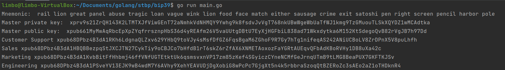

# Лабораторна робота №4
## Використання мнемонічних фраз для формування ключів шифрування
##### Роботу виконав
- Кліщов Богдан
- КН-922б
##### Мета: Дослідити принципи роботи шифрування за допомогою мнемонічних фраз для формування ключів шифрування на прикладі алгоритму bip39
##### Завдання:
-	Використовуючи алгоритм bip39, створити seed генератора псевдовипадкових чисел за допомогою мнемонічної фрази та стосовні ключі шифрування.
-	Зашифрувати текст
-	Використовуючи раніше створену мнемонічну фразу, відновити ключі шифрування на дешифрувати текст. Вдосконалитись, що оригінальний та дешифрований тексти однакові.

##### Розроблені функції отримання мнемонічної фрази та seed:

    func NewEntropy(bitSize int) ([]byte, error) {
      if err := validateEntropyBitSize(bitSize); err != nil {
        return nil, err
      }

      entropy := make([]byte, bitSize/8)
      _, _ = rand.Read(entropy) // err is always nil

      return entropy, nil
    }

    func EntropyFromMnemonic(mnemonic string) ([]byte, error) {
      mnemonicSlice, isValid := splitMnemonicWords(mnemonic)
      if !isValid {
        return nil, ErrInvalidMnemonic
      }

      var (
        wordBytes [2]byte
        b         = big.NewInt(0)
      )

      for _, v := range mnemonicSlice {
        index, found := wordMap[v]
        if !found {
          return nil, fmt.Errorf("word `%v` not found in reverse map", v)
        }

        binary.BigEndian.PutUint16(wordBytes[:], uint16(index))
        b.Mul(b, shift11BitsMask)
        b.Or(b, big.NewInt(0).SetBytes(wordBytes[:]))
      }

      // Build and add the checksum to the big.Int.
      checksum := big.NewInt(0)
      checksumMask := wordLengthChecksumMasksMapping[len(mnemonicSlice)]
      checksum = checksum.And(b, checksumMask)

      b.Div(b, big.NewInt(0).Add(checksumMask, bigOne))

      entropy := b.Bytes()
      entropy = padByteSlice(entropy, len(mnemonicSlice)/3*4)

      entropyChecksumBytes := computeChecksum(entropy)
      entropyChecksum := big.NewInt(int64(entropyChecksumBytes[0]))

      if l := len(mnemonicSlice); l != 24 {
        checksumShift := wordLengthChecksumShiftMapping[l]
        entropyChecksum.Div(entropyChecksum, checksumShift)
      }

      if checksum.Cmp(entropyChecksum) != 0 {
        return nil, ErrChecksumIncorrect
      }

      return entropy, nil
    }

    func NewMnemonic(entropy []byte) (string, error) {
      entropyBitLength := len(entropy) * 8
      checksumBitLength := entropyBitLength / 32
      sentenceLength := (entropyBitLength + checksumBitLength) / 11

      err := validateEntropyBitSize(entropyBitLength)
      if err != nil {
        return "", err
      }

      entropy = addChecksum(entropy)
      entropyInt := new(big.Int).SetBytes(entropy)
      words := make([]string, sentenceLength)
      word := big.NewInt(0)

      for i := sentenceLength - 1; i >= 0; i-- {
        word.And(entropyInt, last11BitsMask)
        entropyInt.Div(entropyInt, shift11BitsMask)

        wordBytes := padByteSlice(word.Bytes(), 2)

        words[i] = wordList[binary.BigEndian.Uint16(wordBytes)]
      }

      return strings.Join(words, " "), nil
    }

##### Результати роботи програми

##### Висновки
Досліджено принципи роботи шифрування за допомогою мнемонічних фраз для формування ключів шифрування на прикладі алгоритму bip39. Розроблено програму роботи даного алгоритму
