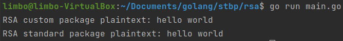

# Лабораторна робота №3
## Асиметричне шифрування. Алгоритм RSA
##### Роботу виконав
- Кліщов Богдан
- КН-922б
##### Мета: Дослідити і реалізувати механізм асиметричного алгоритму шифрування RSA
##### Завдання:
Розробити додаток обміну таємними посиланнями між двома клієнтами за допомогою алгоритму шифрування RSA
- Реалізувати алгоритм генерації ключів (public / private keys) для алгоритму RSA. Створити ключі заданої довжини (напр. 1024 біт)
- Реалізувати та продемонструвати роботу алгоритму шифрування та дешифрування повідомлення RSA
- Підтвердити роботу реалізованого алгоритму шляхом порівняння результату кодування з існуючим алгоритмом (наприклад, використовуючи утиліту openssl або вбудовані системи шифрування обраної мови програмування)

##### Розроблені функції отримання ключів, шифрування та розшифровки:

    func (rsas *RSASecurity) PubKeyENCTYPT(input []byte) ([]byte, error) {
        if rsas.pubkey == nil {
            return []byte(""), errors.New(`Please set the public key in advance`)
        }
        output := bytes.NewBuffer(nil)
        err := pubKeyIO(rsas.pubkey, bytes.NewReader(input), output, true)
        if err != nil {
            return []byte(""), err
        }
        return ioutil.ReadAll(output)
    }

    func (rsas *RSASecurity) PubKeyDECRYPT(input []byte) ([]byte, error) {
        if rsas.pubkey == nil {
            return []byte(""), errors.New(`Please set the public key in advance`)
        }
        output := bytes.NewBuffer(nil)
        err := pubKeyIO(rsas.pubkey, bytes.NewReader(input), output, false)
        if err != nil {
            return []byte(""), err
        }
        return ioutil.ReadAll(output)
    }

    func (rsas *RSASecurity) PriKeyENCTYPT(input []byte) ([]byte, error) {
        if rsas.prikey == nil {
            return []byte(""), errors.New(`Please set the private key in advance`)
        }
        output := bytes.NewBuffer(nil)
        err := priKeyIO(rsas.prikey, bytes.NewReader(input), output, true)
        if err != nil {
            return []byte(""), err
        }
        return ioutil.ReadAll(output)
    }

    func (rsas *RSASecurity) PriKeyDECRYPT(input []byte) ([]byte, error) {
        if rsas.prikey == nil {
            return []byte(""), errors.New(`Please set the private key in advance`)
        }
        output := bytes.NewBuffer(nil)
        err := priKeyIO(rsas.prikey, bytes.NewReader(input), output, false)
        if err != nil {
            return []byte(""), err
        }

        return ioutil.ReadAll(output)
    }

    func PublicEncrypt(data, publicKey string) (string, error) {

        grsa := RSASecurity{}
        grsa.SetPublicKey(publicKey)

        rsadata, err := grsa.PubKeyENCTYPT([]byte(data))
        if err != nil {
            return "", err
        }

        return base64.StdEncoding.EncodeToString(rsadata), nil
    }

    func PriKeyEncrypt(data, privateKey string) (string, error) {

        grsa := RSASecurity{}
        grsa.SetPrivateKey(privateKey)

        rsadata, err := grsa.PriKeyENCTYPT([]byte(data))
        if err != nil {
            return "", err
        }

        return base64.StdEncoding.EncodeToString(rsadata), nil
    }

    func PublicDecrypt(data, publicKey string) (string, error) {

        databs, _ := base64.StdEncoding.DecodeString(data)

        grsa := RSASecurity{}
        if err := grsa.SetPublicKey(publicKey); err != nil {
            return "", err
        }

        rsadata, err := grsa.PubKeyDECRYPT(databs)
        if err != nil {
            return "", err
        }
        return string(rsadata), nil
    }

    func PriKeyDecrypt(data, privateKey string) (string, error) {

        databs, _ := base64.StdEncoding.DecodeString(data)

        grsa := RSASecurity{}

        if err := grsa.SetPrivateKey(privateKey); err != nil {
            return "", err
        }

        rsadata, err := grsa.PriKeyDECRYPT(databs)
        if err != nil {
            return "", err
        }

        return string(rsadata), nil
    }

##### Результати роботи програми

##### Висновки
Досліджено і реалізувано механізм асиметричного алгоритму шифрування RSA. Розроблено програму роботи даного алгоритму
