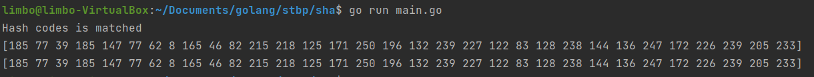

Кліщов Богдан

КН-922б

# Лабораторна робота №1
## Хешування

##### Мета: Дослідити і реалізувати механізм хешування алгоритму SHA
##### Завдання:
- Дослідити існуючі механізми гешування. Реалізувати алгоритм гешування SHA (будь-якої версії). Реализацію інших алгоритмів гешування слід омовити з викладачем.
- Довести коректність роботи реалізованого алгоритму шляхом порівняння результатів з існуючими реалізаціями

##### Розроблена функція хешування:

    func Hash(message []byte) [32]byte {
    	message = pad(message)
    
    	// Initialize round constants
    	h0, h1, h2, h3, h4, h5, h6, h7 := uint32(0x6a09e667), uint32(0xbb67ae85), uint32(0x3c6ef372), uint32(0xa54ff53a),
    		uint32(0x510e527f), uint32(0x9b05688c), uint32(0x1f83d9ab), uint32(0x5be0cd19)
    
    	for chunkStart := 0; chunkStart < len(message); chunkStart += chunkSize {
    		var w [64]uint32
    		for i := 0; i*4 < chunkSize; i++ {
    			w[i] = binary.BigEndian.Uint32(message[chunkStart+i*4 : chunkStart+(i+1)*4])
    		}

    		for i := 16; i < 64; i++ {
    			s0 := bits.RotateLeft32(w[i-15], -7) ^ bits.RotateLeft32(w[i-15], -18) ^ (w[i-15] >> 3)
    			s1 := bits.RotateLeft32(w[i-2], -17) ^ bits.RotateLeft32(w[i-2], -19) ^ (w[i-2] >> 10)
    			w[i] = w[i-16] + s0 + w[i-7] + s1
    		}
    
    		a, b, c, d, e, f, g, h := h0, h1, h2, h3, h4, h5, h6, h7
    		for i := 0; i < 64; i++ {
    			S1 := bits.RotateLeft32(e, -6) ^ bits.RotateLeft32(e, -11) ^ bits.RotateLeft32(e, -25)
    			ch := (e & f) ^ ((^e) & g)
    			tmp1 := h + S1 + ch + K[i] + w[i]
    			S0 := bits.RotateLeft32(a, -2) ^ bits.RotateLeft32(a, -13) ^ bits.RotateLeft32(a, -22)
    			maj := (a & b) ^ (a & c) ^ (b & c)
    			tmp2 := S0 + maj
    			h = g
    			g = f
    			f = e
    			e = d + tmp1
    			d = c
    			c = b
    			b = a
    			a = tmp1 + tmp2
    		}
    		h0 += a
    		h1 += b
    		h2 += c
    		h3 += d
    		h4 += e
    		h5 += f
    		h6 += g
    		h7 += h
    	}
    	digest := [32]byte{}
    	binary.BigEndian.PutUint32(digest[:4], h0)
    	binary.BigEndian.PutUint32(digest[4:8], h1)
    	binary.BigEndian.PutUint32(digest[8:12], h2)
    	binary.BigEndian.PutUint32(digest[12:16], h3)
    	binary.BigEndian.PutUint32(digest[16:20], h4)
    	binary.BigEndian.PutUint32(digest[20:24], h5)
    	binary.BigEndian.PutUint32(digest[24:28], h6)
    	binary.BigEndian.PutUint32(digest[28:], h7)
    	return digest
    }

##### Результати роботи програми

##### Висновки
Досліджено і реалізувано механізм хешування алгоритму SHA256. Розроблено програму роботи даного алгоритму