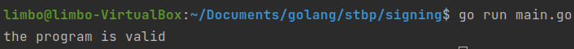
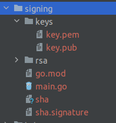

# Лабораторна робота №9
## Захист від зміни бінарного файлу
##### Роботу виконав
- Кліщов Богдан
- КН-922б
##### Мета: Навчитися підписувати виконувані файли
##### Завдання:
-	створити сертифікат
-	проінсталювати його в систему, щоб він був "довіреним"
-	використовуючи проект будь-якої попередньої роботи, виконати підпис виконуваного файлу за допомогою утиліти SignTool (або JarSigner)
-	виконати верифікацію підпису (бажано на рівні самого кода при завантаженні додатка):
--	чи є підписаний сертифікат валідним
--	чи не було (бінарної) зміни файлу та його код цілісний
P.S. Лабораторна робота розрахована для windows-виконуючих файлів або java файлів. Але якщо робота будет зроблена для Linux/Macos виконуючих балів - це вам плюс до карми та можливість отримати додаткові бали.

##### Розроблені функції електронного підпису та перевірки:

    func signFile(priKey string, filePath string) error {
      file, err := ioutil.ReadFile(filePath)
      if err != nil {
        return err
      }
      hash := sha256.Sum256(file)
      signature, err := rsa.PriKeyEncrypt(string(hash[:]), priKey)
      if err != nil {
        return err
      }
      created, err := os.Create("./sha.signature")
      if err != nil {
        return err
      }
      _, err = created.Write([]byte(signature))
      if err != nil {
        return err
      }
      return nil
    }

    func verifySignature(pubKey string, signature string, filePath string) (bool, error) {
      file, err := ioutil.ReadFile(filePath)
      if err != nil {
        return false, err
      }
      hash := sha256.Sum256(file)
      decrypt, err := rsa.PublicDecrypt(signature, pubKey)
      if err != nil {
        return false, err
      }
      if decrypt != string(hash[:]) {
        return false, nil
      }
      return true, nil
    }

##### Результати роботи програми

##### Висновки
Навчився підписувати виконувані файли
