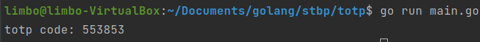

# Лабораторна робота №8
## Time-based One Time Password
##### Роботу виконав
- Кліщов Богдан
- КН-922б
##### Мета: Дослідити і реалізувати механізм генерації одноразових паролів TOTP
##### Завдання:
Дослідити та реалізувати алгоритм Time-based One Time Password. 
Створити програму, що демонструє роботу розробленого алгоритму. 
Організувати взаємодію з мобільним додатком Google Authenticator.

##### Розроблені функції шифрування та розшифровки:

    func getHOTPToken(secret string, interval int64) string {

      key, err := base32.StdEncoding.DecodeString(strings.ToUpper(secret))
      check(err)
      bs := make([]byte, 8)
      binary.BigEndian.PutUint64(bs, uint64(interval))
      hash := hmac.New(sha1.New, key)
      hash.Write(bs)
      h := hash.Sum(nil)
      o := h[19] & 15
      var header uint32
      r := bytes.NewReader(h[o : o+4])
      err = binary.Read(r, binary.BigEndian, &header)
      check(err)
      h12 := (int(header) & 0x7fffffff) % 1000000
      otp := strconv.Itoa(int(h12))

      return prefix0(otp)
    }

    func getTOTPToken(secret string) string {

      interval := time.Now().Unix() / 30
      return getHOTPToken(secret, interval)
    }

##### Результати роботи програми

##### Висновки
Досліджено і реалізувано механізм генерації одноразових паролів TOTP
